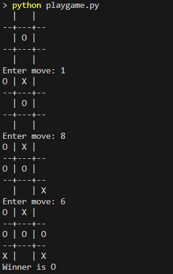
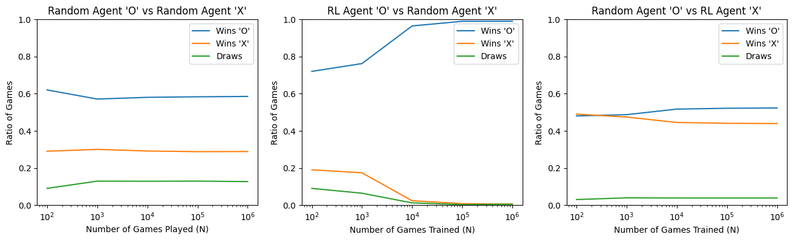

# Tic Tac Toe RL Agent Report


## Introduction
Tic Tac Toe is a simple two-player game where the first player uses 'O' and the second player uses 'X'. Players take turns marking a 3x3 grid, and the first to align three of their marks horizontally, vertically, or diagonally wins the game.

## Q-Learning Overview
Q-Learning is an online, off-policy reinforcement learning algorithm used to find the optimal action-selection policy for any given finite Markov decision process. It employs epsilon-greedy exploration and uses the SARSAmax method of TD(0) updates. In this project, the state of the game is represented as a 9-tuple indicating the board status. Each cell in the 3x3 grid can be in one of three states: empty, occupied by 'O', or occupied by 'X'. The agent learns to play the game by exploring different board configurations and updating its Q-values based on the rewards received from winning, losing, or drawing a game.

The Q-value for a state-action pair is updated using the following formula:
$ Q(s, a) \leftarrow Q(s, a) + \alpha [r + \gamma \max_{a'} Q(s', a') - Q(s, a)] $
where:
- $ s $ is the current state
- $ a $ is the action taken
- $ r $ is the reward received
- $ s' $ is the next state
- $ \alpha $ is the learning rate
- $ \gamma $ is the discount factor

By iteratively updating the Q-values, the agent converges to an optimal policy that maximizes its expected reward over time.

## Training the RL Agent
The RL agent was trained using Q-Learning and an instance of the estimated Q-values were saved for future use. The training and saving process is documented in `qlearn.ipynb`. To manually play the side 'X' against the trained 'O' agent, run the following command from the terminal:
```
python playgame.py
```


## Evaluation
The results of the training were evaluated in `evaluate.ipynb`. The model was trained for different numbers of iterations (Ns) from both sides (O and X). To compare the results, simulations were run for:
- Two random players playing against each other
- A trained RL agent for O playing against a random X
- A trained RL agent for X playing against a random O

The plot below depicts these results:


## Observations
In Tic Tac Toe, the player who plays as 'O' typically has a significant advantage due to the first-move benefit. This advantage is reflected in the results of various simulations:
- When two random players compete, 'O' wins approximately 60% of the time, 'X' wins around 30%, and about 10% of the games end in a draw.
- When the RL agent plays as 'O' against a random 'X', the win ratio for 'O' approaches 1 as the number of training iterations increases, indicating that the RL agent wins nearly all games.
- Conversely, when a random 'O' plays against the RL agent as 'X', the win rate for 'X' increases to around 50% with more training iterations, which is higher than the 30% win rate observed in random vs. random games. The win rate for 'O' also remains at 50%, showing a balanced performance between the two players.
- Overall, the RL agent's performance improves significantly with more training iterations, demonstrating the effectiveness of the Q-Learning algorithm in learning optimal strategies.


